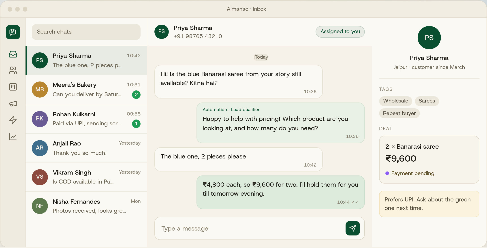

<h1 align="center">Almanac</h1>

<p align="center">
  <strong>The WhatsApp CRM for small businesses and one-person companies.</strong><br>
  Shared inbox, contacts, sales pipelines, broadcasts and no-code automations.<br>
  Self-hosted, so your customers and your data stay yours.
</p>

<p align="center">
  <a href="https://almanac.bar">almanac.bar</a> ·
  <a href="#quick-start-install-in-one-line">Install</a> ·
  <a href="./docs/README.md">Guide</a> ·
  <a href="mailto:tuhin@almanac.bar">Support</a>
</p>

<p align="center">
  <a href="https://github.com/trulytuhin/almanac-crm/actions/workflows/ci.yml"></a>
  <a href="./LICENSE"></a>
  
  
</p>

<p align="center">
  
</p>

---

If your business runs on WhatsApp, your sales pipeline is probably a
scroll of unread chats, a notebook, and a lot of "sorry for the late
reply". Almanac turns that into one tidy place: every conversation, every
customer, every deal, and the follow-ups that used to slip.

It runs on the official WhatsApp Business Platform, so no phone has to
stay switched on, automations stay within WhatsApp's rules, and your
whole team (or just you) can answer from a browser.

## Quick start: install in one line

**macOS / Linux**

```bash
curl -fsSL https://almanac.bar/install.sh | bash
```

**Windows** (cmd or PowerShell)

```bat
powershell -c "irm https://almanac.bar/install.ps1 | iex"
```

That's it. The installer checks your computer, downloads Almanac, asks
for your Supabase and Meta keys, creates the database and starts the app
on <http://localhost:3000>. Run it again any time to update.

Before you run it, have ready (both free, about 20 minutes):

1. A **Supabase project**: [how to create it](./docs/supabase.md)
2. A **Meta app with WhatsApp**: [how to create it](./docs/whatsapp-setup.md)

You also need [Node.js 20+](https://nodejs.org) and [git](https://git-scm.com).
The installer tells you if either is missing.

## Guide

| | |
|---|---|
| [Getting started](./docs/getting-started.md) | Install and first run |
| [Supabase setup](./docs/supabase.md) | Database, keys, sign-up emails |
| [WhatsApp setup](./docs/whatsapp-setup.md) | Meta app, permanent token, webhook, messaging rules |
| [Using Almanac](./docs/user-guide.md) | Inbox, contacts, pipelines, broadcasts, automations, team |
| [AI features (BYOK)](./docs/ai-byok.md) | Bring your own OpenAI or Anthropic key |
| [Deploying](./docs/deployment.md) | Vercel, a VPS or any Node host |
| [Troubleshooting](./docs/troubleshooting.md) | Fixes for the common problems |

Also on the web at [almanac.bar/guide](https://almanac.bar/guide).

## Support

Email **[tuhin@almanac.bar](mailto:tuhin@almanac.bar)**, or
[open an issue](https://github.com/trulytuhin/almanac-crm/issues/new/choose)
for bugs. More in [SUPPORT.md](./.github/SUPPORT.md).

## Who it's for

- **One-person companies.** A baker, a tutor, a boutique, a consultant.
  You answer every message yourself and need to stop losing track.
- **Small teams.** A shop with three people on the counter, an agency, a
  clinic front desk. Several people, one WhatsApp number, no double
  replies.
- **Growing businesses** that tried spreadsheets and "WhatsApp Business
  labels" and outgrew both, but don't want a per-seat SaaS bill.

## What you get

- **Shared inbox.** Everyone works the same number. Assign chats, mark
  them done, leave private notes, react, reply with voice notes, images
  and documents.
- **Contacts.** Tags, custom fields, CSV import and duplicate detection.
  Phone numbers are checked for a country code so nothing goes to the
  wrong country.
- **Sales pipelines.** A Kanban board of deals linked to the chat they
  came from. New pipelines start with *New enquiry, Interested, Quote
  sent, Payment pending, Won*.
- **Rupees first.** New accounts default to INR, amounts use Indian
  grouping (₹1,23,456) and dashboards count in lakh and crore. Every
  other currency is one setting away.
- **Broadcasts.** Send Meta-approved templates to a tag or a CSV, with
  per-person details filled in, and see who received and read them.
- **No-code automations.** Welcome messages, out-of-office replies,
  price enquiries, follow-up nudges. Triggers, conditions, waits, tags
  and webhooks in a visual builder.
- **Chatbot flows.** Button menus for FAQs, order lookups and routing,
  with a clean handoff to a human.
- **AI replies, on your own key (BYOK).** Bring an OpenAI or Anthropic key
  for one-click drafted replies or an auto-reply bot that answers from
  your own FAQs. You pay the provider directly; no per-seat AI fee.
  [Set it up](./docs/ai-byok.md).
- **Dashboard.** Response times, daily volume, pipeline value and a live
  activity feed.
- **Team roles.** Owner, admin, agent and viewer. Invite by link. Solo
  use needs zero setup.
- **API and MCP.** A REST API with scoped keys and signed webhooks, plus
  an MCP server so Claude or Cursor can work your inbox.

## Why self-hosted

- **Your data.** Conversations live in your own Supabase project, not a
  vendor's. WhatsApp tokens are encrypted with AES-256-GCM, every table
  has row-level security, and every webhook is signature-checked.
- **Your costs.** Pay Meta's WhatsApp message fees and your hosting.
  That's it. No seats, no markup.
- **Your changes.** Plain Next.js, Supabase and Tailwind. Add the field
  your business needs.

## Stack

Next.js 16 (App Router) · React 19 · Supabase (Postgres, Auth, Realtime,
Storage) · Tailwind CSS 4 · WhatsApp Cloud API · Vitest

## Updates

Almanac keeps improving. To get the latest version:

- **Installed with the one-liner:** run `almanac update`, or click
  **Update now** in **Settings → Updates**.
- **On Vercel:** click **Sync fork** on your GitHub copy; Vercel
  redeploys by itself.

Your data and settings are kept. Details in
[Using Almanac → Updating](./docs/user-guide.md#updating-almanac).

## Contributing

Bug reports and pull requests are welcome. Start with
[CONTRIBUTING.md](./CONTRIBUTING.md). Security issues go through
[SECURITY.md](./.github/SECURITY.md), not public issues.

## License

[MIT](./LICENSE).

Website [privacy policy](https://almanac.bar/privacy) and
[terms](https://almanac.bar/terms).
